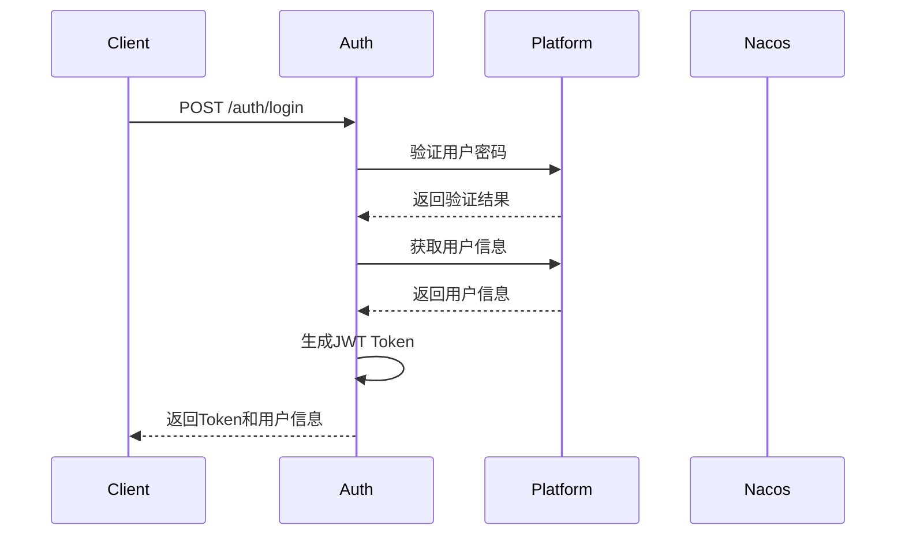
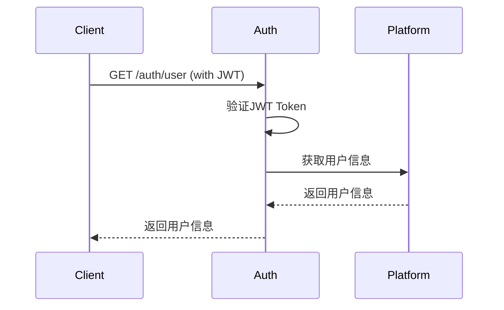

# 认证服务职责分离说明

## 概述

经过重构，认证服务（Auth Service）现在专注于认证和授权功能，用户管理功能已完全移至平台服务（Platform Service）。这符合微服务架构的单一职责原则。

## 认证服务职责

### ✅ **保留的功能**

#### 1. 用户认证
- **登录验证**：验证用户名和密码
- **JWT Token 生成**：生成访问令牌和刷新令牌
- **Token 验证**：验证 JWT token 的有效性
- **Token 刷新**：使用刷新令牌获取新的访问令牌

#### 2. 用户授权
- **权限检查**：基于 JWT token 进行权限验证
- **角色验证**：检查用户角色权限
- **安全上下文**：维护用户认证状态

#### 3. 安全配置
- **Spring Security 配置**：配置安全策略
- **JWT 过滤器**：处理 JWT token 认证
- **CORS 配置**：跨域资源共享配置

### ❌ **移除的功能**

#### 1. 用户管理
- ~~用户创建~~
- ~~用户查询~~
- ~~用户更新~~
- ~~用户删除~~
- ~~用户列表获取~~

#### 2. 用户数据存储
- ~~本地用户实体~~
- ~~用户数据缓存~~
- ~~用户状态管理~~

## 服务边界

### 认证服务 (Auth Service)
```
职责：认证和授权
├── 用户登录验证
├── JWT Token 管理
├── 权限检查
└── 安全配置
```

### 平台服务 (Platform Service)
```
职责：用户和权限管理
├── 用户信息管理
├── 角色权限管理
├── 部门管理
└── 用户数据存储
```

## API 接口

### 认证服务接口

#### 认证相关
```http
POST /auth/login          # 用户登录
POST /auth/refresh        # 刷新令牌
POST /auth/logout         # 用户登出
GET  /auth/validate       # 验证令牌
GET  /auth/user           # 获取当前用户信息
```

#### 内部接口
```http
GET  /auth/health         # 健康检查
```

### 平台服务接口

#### 用户管理
```http
GET    /api/platform/external/users/username/{username}     # 根据用户名获取用户
GET    /api/platform/external/users/{id}                   # 根据ID获取用户
POST   /api/platform/external/users/batch                  # 批量获取用户
GET    /api/platform/external/users/validate               # 验证用户密码
```

#### 权限管理
```http
GET    /api/platform/external/users/{id}/permissions       # 获取用户权限
GET    /api/platform/external/users/{id}/roles            # 获取用户角色
```

## 数据流

### 登录流程


### 用户信息获取流程


## 配置要求

### 服务依赖
- **认证服务** → **平台服务**：通过 FeignClient 调用
- **认证服务** → **Nacos**：服务发现和配置管理
- **平台服务** → **Nacos**：服务发现和配置管理

### 启动顺序
1. 启动 Nacos 服务器
2. 启动 Platform 服务
3. 启动 Auth 服务
4. 启动 Gateway 服务

## 优势

### 1. 职责清晰
- **认证服务**：专注于认证和授权
- **平台服务**：专注于用户和权限管理
- **边界明确**：避免功能重复

### 2. 可维护性
- **代码简洁**：每个服务功能单一
- **易于测试**：职责明确，测试简单
- **独立部署**：服务可以独立更新

### 3. 可扩展性
- **水平扩展**：可以独立扩展认证服务
- **功能扩展**：可以独立添加新功能
- **技术栈**：可以使用不同的技术栈

### 4. 安全性
- **最小权限**：认证服务只有必要的权限
- **数据隔离**：用户数据统一管理
- **审计友好**：操作日志清晰

## 注意事项

### 1. 服务调用
- 认证服务调用平台服务时需要考虑网络延迟
- 需要实现熔断和重试机制
- 监控服务调用的成功率

### 2. 数据一致性
- 用户信息变更时需要考虑缓存更新
- 权限变更时需要考虑 token 失效
- 实现最终一致性

### 3. 性能优化
- 实现用户信息本地缓存
- 优化 JWT token 验证性能
- 监控服务性能指标

## 监控指标

### 认证服务
- 登录成功率
- Token 验证性能
- 服务调用延迟
- 错误率统计

### 平台服务
- 用户查询性能
- 密码验证性能
- 数据库连接池状态
- 缓存命中率

这样的架构设计使得系统更加清晰、可维护和可扩展！
