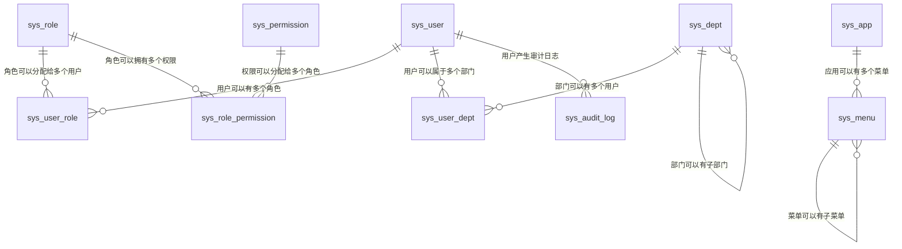

# Platform 数据库表结构分析

## 概述

Platform 服务采用基于 RBAC（Role-Based Access Control）的权限控制模型，结合组织架构管理和资源管理，构建了完整的权限管理体系。本文档详细分析了各个表之间的关系和设计理念。

## 表结构概览

### 核心实体表
- `sys_user` - 用户表
- `sys_role` - 角色表  
- `sys_permission` - 权限表
- `sys_dept` - 部门表
- `sys_app` - 应用表
- `sys_menu` - 菜单表

### 关系表
- `sys_user_role` - 用户角色关系表
- `sys_role_permission` - 角色权限关系表
- `sys_user_dept` - 用户部门关系表

### 审计表
- `sys_audit_log` - 审计日志表

## 详细表结构分析

### 1. 用户表 (sys_user)

```sql
CREATE TABLE sys_user (
  id            BIGINT PRIMARY KEY AUTO_INCREMENT,
  username      VARCHAR(64) NOT NULL UNIQUE,
  password      VARCHAR(255) NOT NULL,
  nickname      VARCHAR(64),
  email         VARCHAR(128),
  phone         VARCHAR(32),
  status        TINYINT DEFAULT 1,
  created_at    TIMESTAMP DEFAULT CURRENT_TIMESTAMP,
  updated_at    TIMESTAMP DEFAULT CURRENT_TIMESTAMP ON UPDATE CURRENT_TIMESTAMP
);
```

**字段说明：**
- `id`: 主键，自增
- `username`: 用户名，唯一约束
- `password`: 密码，加密存储
- `nickname`: 昵称
- `email`: 邮箱
- `phone`: 手机号
- `status`: 状态（1-启用，0-禁用）
- `created_at`: 创建时间
- `updated_at`: 更新时间

### 2. 角色表 (sys_role)

```sql
CREATE TABLE sys_role (
  id          BIGINT PRIMARY KEY AUTO_INCREMENT,
  code        VARCHAR(64) NOT NULL UNIQUE,
  name        VARCHAR(64) NOT NULL,
  description VARCHAR(255),
  created_at  TIMESTAMP DEFAULT CURRENT_TIMESTAMP,
  updated_at  TIMESTAMP DEFAULT CURRENT_TIMESTAMP ON UPDATE CURRENT_TIMESTAMP
);
```

**字段说明：**
- `id`: 主键，自增
- `code`: 角色编码，唯一约束
- `name`: 角色名称
- `description`: 角色描述
- `created_at`: 创建时间
- `updated_at`: 更新时间

### 3. 权限表 (sys_permission)

```sql
CREATE TABLE sys_permission (
  id          BIGINT PRIMARY KEY AUTO_INCREMENT,
  code        VARCHAR(128) NOT NULL UNIQUE,
  name        VARCHAR(128) NOT NULL,
  type        VARCHAR(32)  NOT NULL COMMENT 'api|menu|btn',
  created_at  TIMESTAMP DEFAULT CURRENT_TIMESTAMP
);
```

**字段说明：**
- `id`: 主键，自增
- `code`: 权限编码，唯一约束
- `name`: 权限名称
- `type`: 权限类型（api-接口权限，menu-菜单权限，btn-按钮权限）
- `created_at`: 创建时间

### 4. 部门表 (sys_dept)

```sql
CREATE TABLE sys_dept (
  id         BIGINT PRIMARY KEY AUTO_INCREMENT,
  parent_id  BIGINT DEFAULT NULL,
  name       VARCHAR(128) NOT NULL,
  sort_no    INT DEFAULT 0,
  created_at TIMESTAMP DEFAULT CURRENT_TIMESTAMP,
  updated_at TIMESTAMP DEFAULT CURRENT_TIMESTAMP ON UPDATE CURRENT_TIMESTAMP,
  CONSTRAINT fk_dept_parent FOREIGN KEY (parent_id) REFERENCES sys_dept(id)
);
```

**字段说明：**
- `id`: 主键，自增
- `parent_id`: 父部门ID，自引用外键
- `name`: 部门名称
- `sort_no`: 排序号
- `created_at`: 创建时间
- `updated_at`: 更新时间

### 5. 应用表 (sys_app)

```sql
CREATE TABLE sys_app (
  id         BIGINT PRIMARY KEY AUTO_INCREMENT,
  code       VARCHAR(64) NOT NULL UNIQUE,
  name       VARCHAR(128) NOT NULL,
  enabled    TINYINT DEFAULT 1,
  created_at TIMESTAMP DEFAULT CURRENT_TIMESTAMP
);
```

**字段说明：**
- `id`: 主键，自增
- `code`: 应用编码，唯一约束
- `name`: 应用名称
- `enabled`: 是否启用（1-启用，0-禁用）
- `created_at`: 创建时间

### 6. 菜单表 (sys_menu)

```sql
CREATE TABLE sys_menu (
  id         BIGINT PRIMARY KEY AUTO_INCREMENT,
  app_id     BIGINT NOT NULL,
  parent_id  BIGINT DEFAULT NULL,
  name       VARCHAR(128) NOT NULL,
  path       VARCHAR(255),
  permission VARCHAR(128),
  type       VARCHAR(16) NOT NULL COMMENT 'catalog|menu|button',
  icon       VARCHAR(64),
  sort_no    INT DEFAULT 0,
  visible    TINYINT DEFAULT 1,
  CONSTRAINT fk_menu_app FOREIGN KEY (app_id) REFERENCES sys_app(id),
  CONSTRAINT fk_menu_parent FOREIGN KEY (parent_id) REFERENCES sys_menu(id)
);
```

**字段说明：**
- `id`: 主键，自增
- `app_id`: 应用ID，外键关联sys_app
- `parent_id`: 父菜单ID，自引用外键
- `name`: 菜单名称
- `path`: 菜单路径
- `permission`: 权限标识
- `type`: 菜单类型（catalog-目录，menu-菜单，button-按钮）
- `icon`: 图标
- `sort_no`: 排序号
- `visible`: 是否可见（1-可见，0-隐藏）

## 关系表分析

### 1. 用户角色关系表 (sys_user_role)

```sql
CREATE TABLE sys_user_role (
  user_id BIGINT NOT NULL,
  role_id BIGINT NOT NULL,
  PRIMARY KEY (user_id, role_id),
  CONSTRAINT fk_user_role_user FOREIGN KEY (user_id) REFERENCES sys_user(id),
  CONSTRAINT fk_user_role_role FOREIGN KEY (role_id) REFERENCES sys_role(id)
);
```

**关系说明：**
- 多对多关系：一个用户可以有多个角色，一个角色可以分配给多个用户
- 复合主键：`(user_id, role_id)`
- 外键约束：确保数据完整性

### 2. 角色权限关系表 (sys_role_permission)

```sql
CREATE TABLE sys_role_permission (
  role_id       BIGINT NOT NULL,
  permission_id BIGINT NOT NULL,
  PRIMARY KEY (role_id, permission_id),
  CONSTRAINT fk_role_perm_role FOREIGN KEY (role_id) REFERENCES sys_role(id),
  CONSTRAINT fk_role_perm_permission FOREIGN KEY (permission_id) REFERENCES sys_permission(id)
);
```

**关系说明：**
- 多对多关系：一个角色可以拥有多个权限，一个权限可以分配给多个角色
- 复合主键：`(role_id, permission_id)`
- 外键约束：确保数据完整性

### 3. 用户部门关系表 (sys_user_dept)

```sql
CREATE TABLE sys_user_dept (
  user_id BIGINT NOT NULL,
  dept_id BIGINT NOT NULL,
  PRIMARY KEY (user_id, dept_id),
  CONSTRAINT fk_user_dept_user FOREIGN KEY (user_id) REFERENCES sys_user(id),
  CONSTRAINT fk_user_dept_dept FOREIGN KEY (dept_id) REFERENCES sys_dept(id)
);
```

**关系说明：**
- 多对多关系：一个用户可以属于多个部门，一个部门可以有多个用户
- 复合主键：`(user_id, dept_id)`
- 外键约束：确保数据完整性

## 表关系图



## 权限控制模型

### RBAC 模型层次结构

```
用户 (User)
  ↓ 多对多关系
角色 (Role)
  ↓ 多对多关系
权限 (Permission)
```

### 权限类型分类

1. **API权限** (`type='api'`)
   - 控制接口访问权限
   - 例如：`user:list`, `user:create`, `role:update`

2. **菜单权限** (`type='menu'`)
   - 控制菜单显示权限
   - 例如：`platform:user`, `platform:role`

3. **按钮权限** (`type='btn'`)
   - 控制按钮操作权限
   - 例如：`user:delete`, `role:grant`

## 组织架构模型

### 部门层级结构

```
总公司 (parent_id=NULL)
├── 技术部 (parent_id=1)
│   ├── 开发组 (parent_id=2)
│   └── 测试组 (parent_id=2)
├── 市场部 (parent_id=1)
│   ├── 销售组 (parent_id=3)
│   └── 推广组 (parent_id=3)
└── 财务部 (parent_id=1)
```

### 用户部门关系

- 支持用户属于多个部门
- 支持部门层级管理
- 支持数据权限控制

## 应用菜单模型

### 菜单层级结构

```
应用 (App)
└── 菜单 (Menu)
    ├── 目录 (type='catalog')
    │   └── 菜单 (type='menu')
    │       └── 按钮 (type='button')
    └── 菜单 (type='menu')
        └── 按钮 (type='button')
```

### 菜单权限控制

- 菜单项可以关联权限标识
- 支持菜单可见性控制
- 支持按钮级权限控制

## 审计日志模型

### 审计日志表 (sys_audit_log)

```sql
CREATE TABLE sys_audit_log (
  id         BIGINT PRIMARY KEY AUTO_INCREMENT,
  username   VARCHAR(64),
  action     VARCHAR(128),
  resource   VARCHAR(255),
  method     VARCHAR(16),
  ip         VARCHAR(64),
  result     VARCHAR(32),
  message    VARCHAR(512),
  created_at TIMESTAMP DEFAULT CURRENT_TIMESTAMP
);
```

**字段说明：**
- `username`: 操作用户
- `action`: 操作动作
- `resource`: 操作资源
- `method`: HTTP方法
- `ip`: 操作IP
- `result`: 操作结果
- `message`: 操作说明
- `created_at`: 操作时间

## 设计特点

### 1. 灵活性
- 支持多对多关系，用户可以有多个角色和部门
- 支持权限的细粒度控制
- 支持菜单的层级结构

### 2. 可扩展性
- 权限类型可扩展（api、menu、btn）
- 菜单类型可扩展（catalog、menu、button）
- 支持多应用管理

### 3. 数据完整性
- 外键约束确保数据一致性
- 唯一约束防止重复数据
- 非空约束确保必要数据

### 4. 性能优化
- 合理的索引设计
- 复合主键优化查询
- 时间戳字段支持审计

## 使用场景

### 1. 权限控制
- 基于角色的访问控制
- 细粒度权限管理
- 动态权限分配

### 2. 组织管理
- 部门层级管理
- 用户部门分配
- 数据权限控制

### 3. 菜单管理
- 动态菜单生成
- 权限控制菜单显示
- 多应用菜单管理

### 4. 审计追踪
- 操作日志记录
- 安全审计
- 合规性管理

## 总结

Platform 数据库设计采用了成熟的 RBAC 模型，结合组织架构管理和资源管理，构建了完整的权限管理体系。通过合理的表结构设计和关系映射，实现了灵活的权限控制、组织管理和审计追踪功能，为微服务架构提供了强大的权限管理基础。
